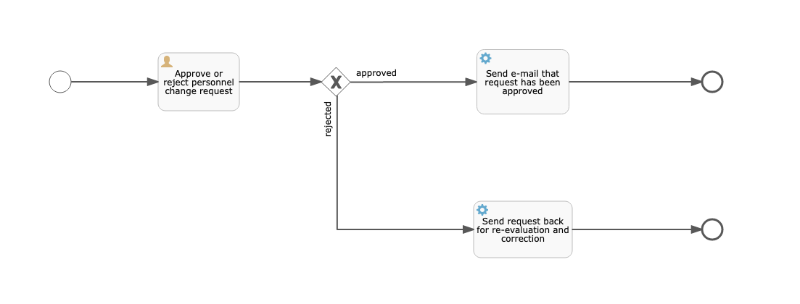

# Flowable REST

## Process

The simple BPMN process modeled and exposed in this example flow is visualized in the following image:

This was created using the Flowable modeler included in the Flowable UI.

Installation of the UI using Docker can be found [here](https://hub.docker.com/r/flowable/flowable-ui).